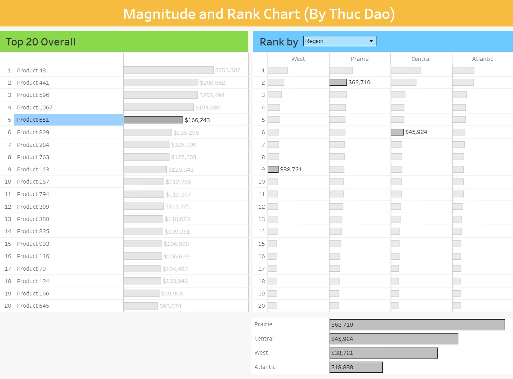
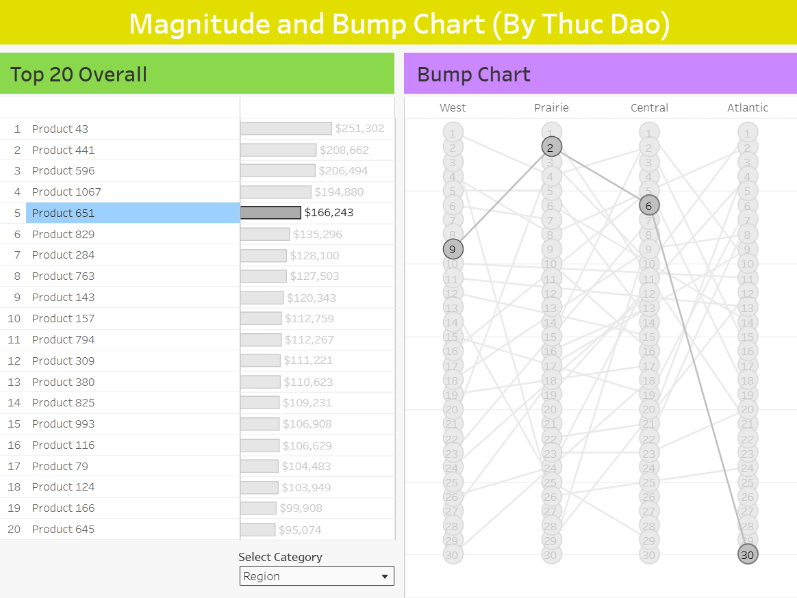
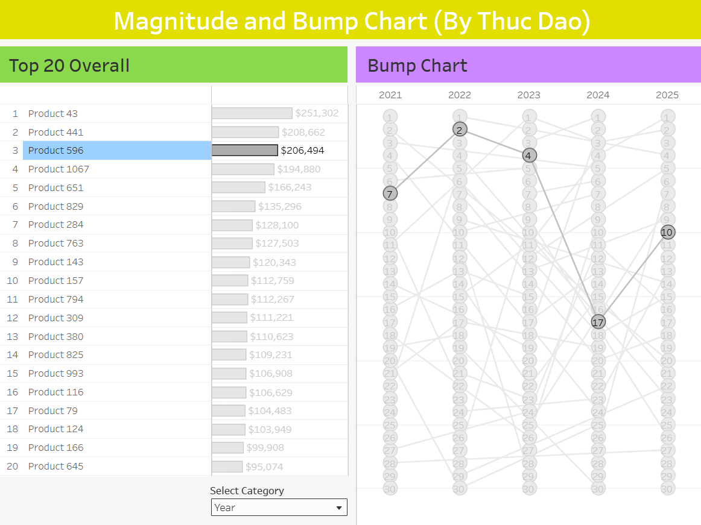

# Magnitude, Rank, and Bump Chart

Ever struggled to visualize both the magnitude (how much) and rank (where it stands) of an item across multiple categories without cluttering your dashboard? 📊

I recently built a Tableau dashboard designed to solve exactly this challenge. It features two interactive approaches: 

1️⃣ **Magnitude & Rank Chart**: A dual-view bar chart system.   
2️⃣ **Magnitude & Bump Chart**: A combined bar and bump chart layout.

### 💡 The Core Feature:  
The dashboard allows users to select any product from the "Top 20 Overall" list and instantly compare its performance across different dimensions (Canadian Regions, Customer Segments, or Years).

To see why this dual-sheet approach is so powerful, let’s look at Product 651: 

🔹 In the Magnitude & Rank Chart, Product 651 is a Top 5 product overall.   
    Broken down by region, it sits comfortably in the Top 10 for the West Coast, Prairie, and Central Canada, but completely disappears from the Top 20 in the Atlantic Provinces.   
    To solve the "hidden data" problem, I added a supplementary bottom chart to capture its exact sales magnitude in the Atlantic region.   

    
🔹 Switching to the Magnitude & Bump Chart, we can see that Product 651 actually ranks 30th in the Atlantic.   
    Because bump charts strip away the magnitude bars to focus purely on rank, they are highly space-efficient.   
    This sheet neatly displays the Top 30 products in the exact same vertical real estate it took to show just 20 in the previous view!   

### 📈 Time-Series Strength: 
While bump charts sacrifice magnitude, they absolutely shine with time-series data.   
By switching the category to "Year", the nodes and lines beautifully track the ranking journey of any overall Top 20 product from 2021 to 2025 (as long as it hits the Top 30 in a given year).   

Using the bump chart for year-over-year analysis reveals the "momentum" of a product. It answers: Is this product a rising star, or is it losing its grip on the market?   

### Why does this matter?   
From a business perspective, this layout is fantastic for monitoring product health, identifying regional weaknesses, and spotting lifecycle trends. But the framework is entirely adaptable outside of retail!    

Imagine applying this to Municipal Management: tracking the volume of utility service requests (Magnitude) vs. the response priority ranking (Rank) across different city wards to optimize resource allocation.   
It’s about seeing the "Big Picture" and the "Fine Detail" at the same time.

---

Explore the interactive dashboards here:   

🔗 Magnitude & Rank Chart:
    https://public.tableau.com/app/profile/thuc.dao/viz/MagnitudeRankandBumpChart/MagnitudeandRankChart
    
🔗 Magnitude & Bump Chart:
    https://public.tableau.com/app/profile/thuc.dao/viz/MagnitudeRankandBumpChart/MagnitudeandBumpChart
